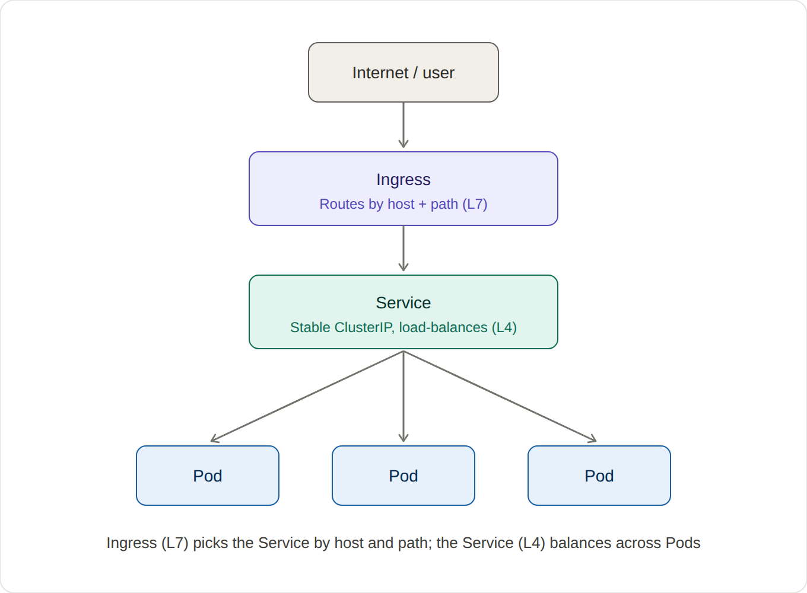

# Services and Ingress: Routing Traffic

A request reaches your app in three hops. Ingress routes by host and path,
a Service load-balances across pods with a stable address, and the pod serves
the response. Pods change constantly. The Service IP does not, which is why
nothing upstream has to track individual pods.



## Run it yourself

Two apps, two Services, one Ingress with two rules. `shop.local/` routes by host,
`api.local/v1` routes by host and path.

```
kubectl create deployment shop --image=nginx --replicas=3
kubectl expose deployment shop --port=80
kubectl create deployment api --image=traefik/whoami --replicas=2
kubectl expose deployment api --port=80
kubectl apply -f ingress.yaml

curl -H "Host: shop.local" http://<node-ip>/      # nginx page, host routing
curl -H "Host: api.local"  http://<node-ip>/v1    # whoami, host + path routing
curl -H "Host: api.local"  http://<node-ip>/       # 404, proves the path rule
```

Get `<node-ip>` from the ADDRESS column of `kubectl get ingress`, and replace the
whole placeholder including the brackets.

## The three pieces

- Ingress: HTTP routing at the edge by host and path.
- Service: stable ClusterIP, load-balances to matching pods.
- Pods: the actual workloads, ephemeral and replaceable.

## Cleanup

```
kubectl delete -f ingress.yaml
kubectl delete deployment shop api
kubectl delete svc shop api
```
